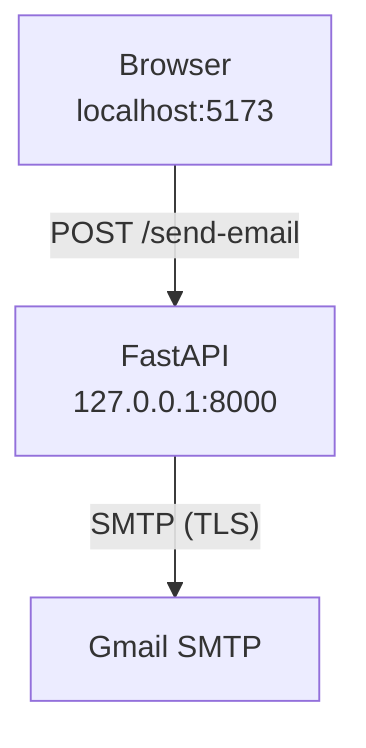

# Backend–Frontend Connections

## Fixing the “CORS / Failed to fetch” error & setting the project up cleanly

This guide explains:

1. **Why** the React contact-form request to `/send-email` failed.
2. **What** to change in the code to follow full-stack best practices.
3. **How** to run the project so frontend & backend always work together.

---

### 1  What really happened

| Step | Browser action | What went wrong |
|------|----------------|-----------------|
| 1 | React called `fetch('http://127.0.0.1:5000/send-email', … )` | |
| 2 | Because `Origin: http://localhost:5174` ≠ request host, the browser issued a CORS **OPTIONS** pre-flight | |
| 3 | No server was listening on **port 5000** (only FastAPI on 8000). The OPTIONS got no valid CORS headers | |
| 4 | The browser threw: `blocked by CORS policy … Failed to fetch` → the Python handler never ran | |

---

### 2  Best-practice adjustments

#### 2.1  Consolidate to *one* backend (FastAPI)

> Retire the separate Flask server and add an e-mail endpoint to FastAPI.

```python
# backend/main.py
from fastapi import FastAPI, HTTPException
from pydantic import BaseModel
from fastapi.middleware.cors import CORSMiddleware
import smtplib, os
from email.mime.text import MIMEText
from email.mime.multipart import MIMEMultipart

app = FastAPI()

# Allow any localhost Vite port during dev
app.add_middleware(
    CORSMiddleware,
    allow_origins=[f"http://localhost:{p}" for p in range(5173, 5180)],
    allow_credentials=False,
    allow_methods=["*"],
    allow_headers=["*"],
)

class MailRequest(BaseModel):
    email: str
    message: str

@app.post("/send-email")
async def send_email(req: MailRequest):
    EMAIL_ADDRESS  = os.getenv("EMAIL_ADDRESS")
    EMAIL_PASSWORD = os.getenv("EMAIL_PASSWORD")

    if not (EMAIL_ADDRESS and EMAIL_PASSWORD):
        raise HTTPException(500, "Email credentials not configured")

    msg = MIMEMultipart()
    msg["From"]     = EMAIL_ADDRESS
    msg["To"]       = EMAIL_ADDRESS
    msg["Reply-To"] = req.email
    msg["Subject"]  = f"Contact form: {req.email}"
    msg.attach(MIMEText(req.message, "plain"))

    try:
        with smtplib.SMTP("smtp.gmail.com", 587) as s:
            s.starttls()
            s.login(EMAIL_ADDRESS, EMAIL_PASSWORD)
            s.send_message(msg)
    except Exception as e:
        raise HTTPException(500, f"Failed to send email: {e}")

    return {"message": "Email sent successfully"}
```

#### 2.2  Reference the API via Vite env variable

Create a **repo-root** `.env` ( `kotiks-web/.env` ) and add:
```env
VITE_API_URL=http://127.0.0.1:8000
```

`Contact.jsx`
```javascript
const API = import.meta.env.VITE_API_URL;

const response = await fetch(`${API}/send-email`, {
  method: 'POST',
  headers: { 'Content-Type': 'application/json' },
  body: JSON.stringify({ email, message }),
});
```

#### 2.3  Correct static-file paths (already applied)

Files placed in `frontend/public/` are served from `/`, so use
`/Olga_Kotova_CV_Mar_2025.pdf` not `/public/…`.

#### 2.4  Process management during development

```bash
# Backend
cd backend
poetry run uvicorn main:app --reload   # → http://127.0.0.1:8000

# Frontend
cd frontend
npm install           # first time only
npm run dev           # → http://localhost:5173
```

*`--reload`* restarts FastAPI on code changes. Vite hot-reloads the React app.

> If you accidentally suspend Vite with **Ctrl + Z**, terminate it:
> `jobs`, then `kill %1` or `fg %1` followed by **Ctrl + C**.

---

### 3  How the pieces fit together



* CORS middleware adds the required `Access-Control-Allow-Origin` header.
* All mail logic is in one place, reducing chances of pointing React at a dead server.

---

### 4  Troubleshooting flow

1. **Browser shows** `blocked by CORS`
   → FastAPI not running or wrong port.
2. **Network tab shows** `POST /send-email` **500**
   → Check credentials or SMTP headers.
3. **No mail but 200 OK**
   → Look in Gmail *Sent* and recipient’s spam folder.

Follow these practices to keep frontend & backend in sync and eliminate the common “Failed to fetch” / CORS headaches during development.

---

## 5  Launch commands after migrating to FastAPI-only backend

```bash
# 1. Backend (FastAPI)
cd backend
poetry install                 # first time only – installs fastapi, uvicorn, etc.
poetry run uvicorn main:app --reload  # http://127.0.0.1:8000

# 2. Frontend (React/Vite)
cd frontend
npm install                    # first time only
# create (or edit) kotiks-web/.env and set VITE_API_URL, e.g.:
echo "VITE_API_URL=http://127.0.0.1:8000" > ../.env   # from frontend dir
npm run dev                    # http://localhost:5173

# 3. Browse to the frontend and test the contact form
open http://localhost:5173      # macOS – or just visit in your browser
```

Things **no longer needed**:

* `backend/server.py`  (removed)
* Flask / flask-cors / django dependencies  (removed from `pyproject.toml`)
* Old instructions in `README.md` that referenced `python backend/server.py` – update when convenient.

With only one backend to manage, port mismatches and CORS headaches are far less likely.

---

## 6  One-command startup (optional)

If you prefer to launch both servers together, use the root-level `package.json` that contains:

```json
{
  "scripts": {
    "dev": "concurrently \"poetry run uvicorn backend.main:app --reload\" \"npm --prefix frontend run dev\""
  }
}
```

Install the helper:

```bash
npm install        # in the repo root – installs `concurrently`
```

Then start **both** backend and frontend with a single command:

```bash
npm run dev
# → FastAPI on http://127.0.0.1:8000
# → Vite    on http://localhost:5173
```

Stop them together with **Ctrl + C**. This is convenient for local development; in production you’d build the frontend (`npm run build`) and serve the static assets via a reversed proxy or CDN.
