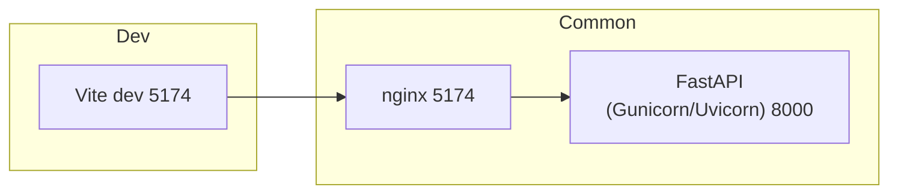

# Proposed Docker-Compose & Nginx Setup

This document outlines the **changes** we will introduce to run the entire stack — FastAPI backend, React (Vite) frontend, and Nginx reverse-proxy — with a single

```bash
docker compose up --build
```

It also explains the different behaviour in **development vs. production** modes.

---

## 1. Directory & File Additions

| Path | Purpose |
|------|---------|
| `backend/Dockerfile` | Multi-stage image: installs Poetry deps → copies code → runs **gunicorn+uvicorn**. |
| `frontend/Dockerfile` | Multi-stage: builds React app → serves static files with Nginx (prod) **or** starts Vite dev server (dev). |
| `nginx/nginx.conf` | Reverse proxy: <br>• `/api/*` ⇒ `backend:8000` <br>• `/` (static) ⇒ built frontend assets. |
| `docker-compose.yml` | Brings up **backend**, **frontend** (optional in prod), and **nginx**. |
| `docker-compose.dev.yml` | Extends base compose for hot-reload dev experience (mounts source, uses `--reload` & Vite dev). |

We keep the root `.env` for shared settings (`VITE_API_URL`, mail creds, etc.).

---

## 2. Service Behaviour

### 2.1 Development (`docker compose -f docker-compose.yml -f docker-compose.dev.yml up`)

| Service | Image | Command | Ports | Hot-reload |
|---------|-------|---------|-------|------------|
| **backend** | python:3.12-slim | `uvicorn backend.main:app --reload --host 0.0.0.0 --port 8000` | 8000 | Yes (volume mount) |
| **frontend** | node:20-alpine | `npm run dev -- --port 5174` | 5174 | Yes (volume mount) |
| **nginx** | nginx:alpine | dev-specific config (<http://localhost:5174>, proxies to 5174/8000) | 5174 | Reload on container restart |

Access:
* Frontend dev UI → <http://localhost:5174>
* Backend docs (FastAPI) → <http://localhost:8000/docs>

### 2.2 Production / Deployment (`docker compose up --build`)

| Service | Image | Command | Ports |
|---------|-------|---------|-------|
| **backend** | `kotiks-web-backend` | `gunicorn -k uvicorn.workers.UvicornWorker -w 4 -b 0.0.0.0:8000 backend.main:app` | 8000 |
| **frontend-build** | node builder stage (build only) | N/A (artifacts copied) | — |
| **nginx** | nginx:alpine | serves built frontend & proxies `/api` to backend | 5174 |

The **frontend** dev container is *not* started; the static React build is copied into Nginx’s `/usr/share/nginx/html` during image build.

---

## 3. Environment Variables

| Variable | Where | Used for |
|----------|-------|----------|
| `EMAIL_ADDRESS` | backend container | SMTP auth |
| `EMAIL_PASSWORD` | backend container | SMTP auth |
| `VITE_API_URL` | frontend dev container | Points React dev server to `http://localhost:8000` |

In production the built JS bundle embeds `/api` (relative) so no env var is required.

---

## 4. High-Level build & runtime flow



* In **dev**, Nginx mainly proxies `/api` to backend; the browser talks to Vite directly.
* In **prod**, Nginx serves the compiled static files and still proxies `/api`.

---

## 5. Commands Cheat-Sheet

### First-time setup
```bash
# Build and run everything for local development
docker compose -f docker-compose.yml -f docker-compose.dev.yml up --build
```

### Day-to-day development
```bash
docker compose -f docker-compose.yml -f docker-compose.dev.yml up
```
Edit code; backend & frontend reload automatically.

### Production image build & run (local test)
```bash
docker compose up --build
```
Visit <http://localhost:5174> – you’ll see the built React site, and API requests go to `/api`.

---

## 6. Migration steps (what we will commit next)

1. Add **backend/Dockerfile** (Poetry install, multi-stage).
2. Add **frontend/Dockerfile** (Vite build; optional dev stage).
3. Add **nginx** folder with `nginx.conf` and `Dockerfile` (copies config + built assets).
4. Add **docker-compose.yml** + **docker-compose.dev.yml**.
5. Update docs & README to use Compose commands.
6. Remove `concurrently` root script if desired — Compose replaces it.

After merging these files, `docker compose up` becomes the single entry-point for both development and deployment scenarios.

---

## 7. Example production deployment workflow

Below is a common pattern for shipping the app to a cloud VM / Droplet.
You can adapt the registry or CI provider to your needs.

### 7.1 CI / Image build & push (GitHub Actions idea)

```yaml
name: build-and-push
on:
  push:
    branches: [ main ]

jobs:
  docker:
    runs-on: ubuntu-latest
    steps:
      - uses: actions/checkout@v4
      - uses: docker/setup-buildx-action@v3
      - uses: docker/login-action@v3
        with:
          registry: ghcr.io
          username: ${{ github.actor }}
          password: ${{ secrets.GITHUB_TOKEN }}

      - name: Build & push (multi-platform)
        uses: docker/build-push-action@v5
        with:
          push: true
          tags: |
            ghcr.io/<org>/kotiks-web-backend:latest
            ghcr.io/<org>/kotiks-web-nginx:latest
          targets: backend,nginx  # defined in docker-compose.yml build section
```

### 7.2 Server preparation (one-off)

```bash
ssh ubuntu@your_server
sudo apt update && sudo apt install docker docker-compose-plugin -y

# add user to docker group if desired
```

### 7.3 Runtime files on the server

```
/opt/kotiks-web/
  ├── docker-compose.yml          # same as in repo, but image tags pin to :latest
  ├── .env.production             # EMAIL_ADDRESS, etc.
  └── certs/                      # optional, if you handle TLS yourself
```

### 7.4 Start / update the stack

```bash
cd /opt/kotiks-web
docker compose pull      # get new backend / nginx images
docker compose up -d     # start (or restart) containers in the background
```

Nginx will listen on **port 5174** (or 80/443 if you adjust the compose file) and proxy `/api` to the backend container.  If you need HTTPS, either:

1. Terminate TLS outside Docker (e.g. with Cloudflare or an ELB), or
2. Use a companion such as [nginx-proxy-letsencrypt](https://github.com/nginx-proxy/acme-companion) or [Caddy] that issues certs automatically.

### 7.5 Zero-downtime update cheat-sheet

```bash
docker compose pull           # fetch new images
docker compose up -d --no-deps --build backend nginx   # recreate only changed services
docker image prune -f         # clean dangling layers
```

### 7.6 Roll-back

Use Docker’s image history or tags:

```bash
docker compose down
docker compose up -d nginx backend # but pin image tags to the previous known-good SHA
```

Following these steps, your production server runs the same container images the CI built and tested, ensuring parity between environments while still exposing the site on **http://<your_domain>:5174** (or 443 for HTTPS).
