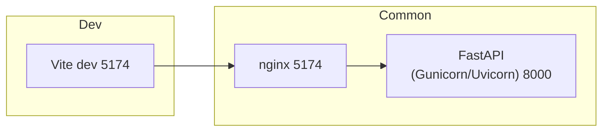

# Local Docker-Compose Setup & Deployment Overview
This guide explains how the project runs **locally** using Docker Compose and how it is **deployed** today.

* Local development → one command (`docker compose -f docker-compose.dev.yml up --build`) spins up:
  * FastAPI backend (hot-reload)
  * Vite frontend (hot-reload)
  * Nginx reverse-proxy — single entry-point on 5174
* Production → the React frontend is automatically built & hosted by **Vercel** at
  `https://kotiks-web.vercel.app/` whenever you push to `main`.
  The FastAPI backend remains containerised and can be deployed to any Docker-friendly host (Fly.io, Render, a VPS, etc.).

---

## 1. Directory & File Additions

| Path | Purpose |
|------|---------|
| `backend/Dockerfile` | Multi-stage image: installs Poetry deps → copies code → runs **gunicorn+uvicorn**. |
| `frontend/Dockerfile` | Multi-stage: builds React app → serves static files with Nginx (prod) **or** starts Vite dev server (dev). |
| `nginx/nginx.conf` | Reverse proxy: <br>• `/api/*` ⇒ `backend:8000` <br>• `/` (static) ⇒ built frontend assets. |
| `docker-compose.dev.yml` | Starts **backend**, **frontend**, and **nginx** for local development with hot-reload. |

We keep the root `.env` for shared settings (`VITE_API_URL`, mail creds, etc.).

---

## 2. Service Behaviour

### 2.1 Development (`docker compose -f docker-compose.dev.yml up --build`)

| Service | Image | Command | Ports | Hot-reload |
|---------|-------|---------|-------|------------|
| **backend** | python:3.12-slim | `uvicorn backend.main:app --reload --host 0.0.0.0 --port 8000` | 8000 | Yes (volume mount) |
| **frontend** | node:20-alpine | `npm run dev -- --port 5175` | 5175 * | Yes (volume mount) |
| **nginx** | nginx:alpine | dev-specific config (<http://localhost:5174>, proxies to 5174/8000) | 5174 | Reload on container restart |

Access:
* Frontend dev UI → <http://localhost:5174>
* Backend docs (FastAPI) → <http://localhost:8000/docs>

### 2.2 Production deployment (current)

| Component | Platform | Notes |
|-----------|----------|-------|
| React frontend | **Vercel** | Auto-builds on every push to `main`, lives at `https://kotiks-web.vercel.app/`. Preview deployments are created for PR branches. |
| FastAPI backend | **Render** (Docker Web Service) | Built from `backend/Dockerfile`, runs on port 8000. Secrets (`EMAIL_ADDRESS`, `EMAIL_PASSWORD`) set in Render dashboard. Remember to allow CORS from the Vercel domain. |

If you later decide to self-host the full stack, you can still create a production-grade Compose file similar to the one described in earlier versions of this document.

---

## 3. Environment Variables

| Variable | Where | Used for |
|----------|-------|----------|
| `EMAIL_ADDRESS` | backend container | SMTP auth |
| `EMAIL_PASSWORD` | backend container | SMTP auth |
| `VITE_API_URL` | frontend dev container | Points React dev server to `http://localhost:8000` |

In production the built JS bundle embeds `/api` (relative) so no env var is required.

---

## 4. High-Level build & runtime flow



* In **dev**, Nginx mainly proxies `/api` to backend; the browser talks to Vite directly.
* In **prod**, Nginx serves the compiled static files and still proxies `/api`.

---

## 5. Commands Cheat-Sheet

### First-time setup
```bash
# Build and run the local dev stack (FastAPI + Vite + Nginx)
docker compose -f docker-compose.dev.yml up --build
```

### Day-to-day development
```bash
docker compose -f docker-compose.dev.yml up
```
Edit code; backend & frontend reload automatically.
---
